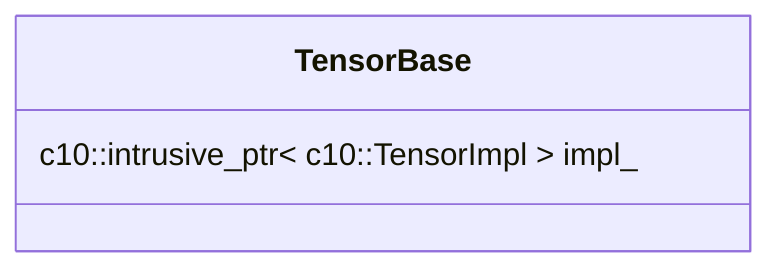
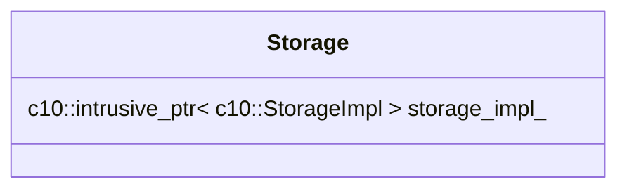
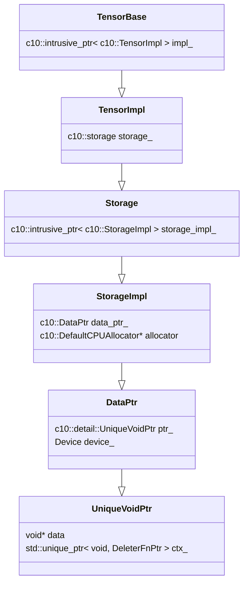
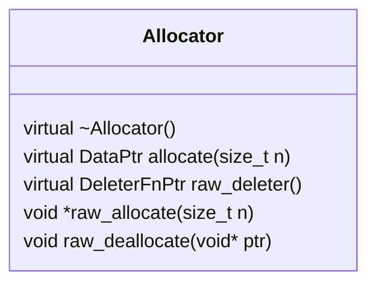
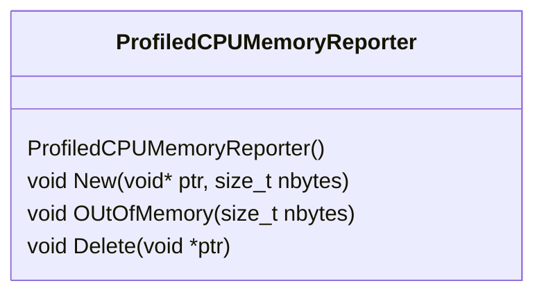

# Tensor Memory Management

As Tensors are the main object being manipulated in many ops implemented in PyTorch, understanding how its memory is being managed is important. This will be a top-to-bottom approach, first covering how memory is wrapped and being manipulated, then discussing the actual memory allocation mechanisms.

## Memory Management

The following are pointer objects that PyTorch developers have implemented, and which play an important role in not only managing any memory that they point to, but also acting as wrappers for other objects.

### Unique Void Pointer

This pointer is implemented in `c10/util/UniqueVoidPtr.h`.

According to comment docs found in the [header file](https://github.com/pytorch/pytorch/blob/master/c10/util/UniqueVoidPtr.h), a `UniqueVoidPtr` is an owning smart pointer like `unique_ptr`, but with three major differences:

1) It is specialized to void
2) It is specialized for a function pointer deleter `void(void* ctx)`.
3) The deleter is guaranteed to be called when the unique pointer is destructed and context is non-null.

This class defines two private member variables, one of which is a `void*` called `data_`, which is where the data found in the Tensor exists in. The other is a `std::unique_ptr<void, DeleterFnPtr>` called `ctx_`, which is presumably the context from which this pointer is tied to.

### Data Pointer

This pointer is implemented in `c10/core/Allocator.h`.

According to comment docs found in the [header file](https://github.com/pytorch/pytorch/blob/master/c10/core/Allocator.h), a `DataPtr` is a unique pointer (with an attached deleter and some context for the deleter) to some memory, which also records what device is for its data.

This class defines two private member variables, one of which is a `c10::detail::UniqueVoidPtr` called `ptr_`. Thus, `DataPtr`s are wrappers for this type of pointer. The other member variable is a `Device` called `device_`, which denotes where in memory the data exists in (i.e. CPU, CUDA/GPU, mobile, etc).

### Intrusive Pointer

This pointer is implemented in `c10/util/intrusive_ptr.h`.

The developers of PyTorch present this as an alternative to a `shared_ptr<>`, which was implemented to have better performance as it performs refcounting intrusively.

According to comment docs found in the [header file](https://github.com/pytorch/pytorch/blob/master/c10/util/intrusive_ptr.h), the class makes use of two member variables for reference counting: `refcount` and `weakcount`. The latter keeps track of the number of strong references to the object being pointed to, and the former keeps track of the number of weak references to the object, plus one more if `refcount` > 0.

Once `refcount` == 0, it can never again be > 0. In addition, finalizers are called and a data pointer (i.e. `DataPtr`) is deallocated.

Based on what has been seen, `intrusive_ptr`s are used as general wrappers to other pointers.

## Data Classes

On top of the pointers, there are classes that also act as wrappers, namely `Tensor` and `Storage`.

The `Tensor` class extends the `TensorBase` class, which contains an `intrusive_ptr` reference to a `TensorImpl` object, which is the actual Tensor implementation.




The `Storage` class, which contains an `intrusive_ptr` reference to a `StorageImpl` object, which is the actual Storage implementation.




## Data Hierarchy

From a top-down approach, the following diagram describes the data hierarchy of Tensors:



Not previously discussed, the `DefaultCPUAllocator` extends an `Allocator` struct defined in the same file as the `DataPtr`. Both play important roles in the memory allocation mechanisms for Tensors.

## Memory Allocation

The `Allocator` struct, defined in `c10/core/Allocator.h`, is designed to be an interface to implement memory allocation mechanisms depending on the platform.



As a quick detour, the `c10/core/CPUAllocator.h` header defines a `ProfiledCPUMemoryReporter` class. According to comment docs, it is meant to be used to report on C10's memory allocation, deallocation status, and any out-of-memory events to the profiler.



A `DefaultCPUAllocator` struct is defined in `c10/core/CPUAllocator.h`, extending the `Allocator` struct. It contains a member function used to initialize a `ProfiledCPUMemoryReporter` object. It also overrides the `allocate()` function that was declared in the `Allocator` struct:

```c++
at::DataPtr allocate(size_t nbytes) const override
{
    void* data = nullptr;
    try
    {
        data = c10::alloc_cpu(nbytes);
    }
    catch (c10::Error& e)
    {
        profiledCPUMemoryReporter().OutOfMemory(nbytes);
        throw e;
    }
    
    profiledCPUMemoryReporter().New(data, nbytes);
    return { data, data, &ReportAndDelete, at::Device(at::DeviceType::CPU) };
}
```

Thus, the `DefaultCPUAllocator` struct exists as a wrapper for the function responsible in allocating memory to the Tensor.

Files associated with the `alloc_cpu()` function can be found in `c10/core/impl`: `alloc_cpu.h`, which handles forward declarations for `void* alloc_cpu(size_t nbytes)` and `void free_cpu(void* data)` functions, and `alloc_cpu.cpp`, which implements the behavior for both `alloc_cpu()` and `free_cpu()` functions.

### alloc_cpu()

The code for `alloc_cpu()` is rather complex, but the start of the function will be linked [here](https://github.com/pytorch/pytorch/blob/2bca280a317f82088faf35e0ac978ff5b913ad8c/c10/core/impl/alloc_cpu.cpp#L46). At a high-level, the function does the following:

- `void* data` is declared
- three blocks of code are present for different platforms, in the following order:
  - Android
  - Microsoft
  - POSIX
    - `int err = posix_memalign(&data, gAlignment, nbytes);`
- `data` is then moved to a thread's NUMA node:
  - `NUMAMove(data, nbytes, GetCurrentNUMANode());`
- Some checks are then to determine whether a zero-fill or a junk-fill will be done

Of interest is the `posix_memalign()` function call. Details can be found [here](https://man7.org/linux/man-pages/man3/posix_memalign.3.html). For the sake of documentation, the function takes three parameters: `void** memptr`, `size_t alignment`, and `size_t size`. When called, the function allocates `size` bytes and places the address of allocated memory in `*memptr`. The address of the allocated memory will be a multiple of `alignment`, whose value must be a power of two and a multiple of `sizeof(void *)`.

Note that the `sizeof()` operator may return a different value depending on the compiler used. On `gcc 9.4.0`, `sizeof(void *)` returns 8 bytes.

The value of `gAlignment` can be found in the `c10/core/alignment.h` file. On a mobile platform, `gAlignment = 16`, but on all other platforms `gAlignment = 64`.

## Summary